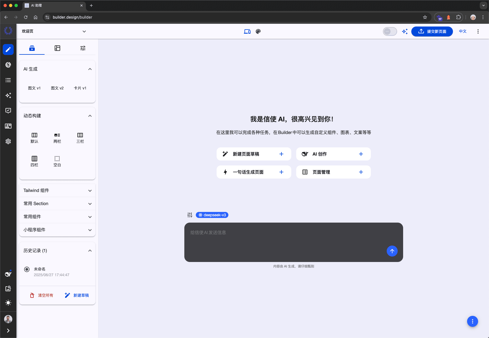

<p align="center">

</p>
<h1 align="center">信使 Web builder<br>AI 驱动 UI 生成和发布的低代码平台</h1>

<p align="center">
  <br>
  <i>AI 驱动 UI 生成和发布的低代码平台，基于TailwindCss，通过拖拽可视化快速构建现代化响应式UI、动态自定义组件、多主题、多语言的网站应用。AI-powered UI generation and publishing low code platform, built on TailwindCSS, enabling rapid drag-and-drop visual creation of modern responsive UIs, dynamic customizable components, multi-theme, and multi-language web applications.
    </i>
  <br>
</p>

<p align="center">
  <a href="https://builder.design"><strong>https://builder.design</strong></a>
  <br>
</p>

<p align="center">
  <a href="https://github.com/biaogebusy/builder-cms">Builder CMS</a>
  ·
  <a href="https://github.com/biaogebusy/xinshi-mini">信使小程序</a>
  ·
  <a href="https://docs.builder.design"> 文档 </a>
  ·
  <a href="https://www.zhihu.com/people/biaogebusy"> 知乎 </a>
   ·
  <a href="https://github.com/biaogebusy/builder-docker"> Docker 部署</a>
  <br>
  <br>
  <a href="https://space.bilibili.com/457248997/lists/2430152?type=season">观看演示视频</a>
</p>

<p align="center">
  
  <br>
  <br>
</p>

> 奥陌陌是已知的第一颗经过太阳系的星际天体，意为"远方信使"。

# 安装部署步骤

## 0. 准备环境

下载或者克隆 docker 配置文件到服务器：

```bash
git clone https://github.com/biaogebusy/builder-docker
```

根据实际需求修改`.env`中的变量，脚本会根据变量创建：

- 前端端口
- 后端端口
- 数据库用户名和密码
- drupal root 超级管理员密码

```bash
### PROJECT SETTINGS
PROJECT_NAME=builder
NODE_PORT=4200
PROJECT_PORT=5080

### PHP
PHP_TAG=8.1

### nginx
NGINX_TAG=1.29
### Mariadb
MARIADB_TAG=11.4
DB_NAME=drupal
DB_USER=drupal
DB_PASSWORD=9QoLiAh1RiVqHv26
DB_ROOT_PASSWORD=R826fXdLZXmovIhi
DB_HOST=mariadb
DB_PORT=3306
DB_DRIVER=mysql

### site
SITE_PASSWORD=8DvyifP9vUSv9%7L
```

## 1. 克隆或者下载 builder docker 项目

```bash
git clone git@github.com:biaogebusy/builder-docker.git
```

## 2. 克隆 Builder cms 仓库

在项目根目录下克隆最新的 builder cms 为 drupal

```bash
git clone git@github.com:biaogebusy/builder-cms.git drupal
```

修改`./init.d/services.yml`中`allowedOrigins`为你的前台域名。

```yml
cors.config:
  enabled: true
  # Specify allowed headers, like 'x-allowed-header'.
  allowedHeaders:
    [
      'x-csrf-token',
      'authorization',
      'content-type',
      'accept',
      'origin',
      'x-requested-with',
    ]
  # Specify allowed request methods, specify ['*'] to allow all possible ones.
  allowedMethods: ['*']
  # Configure requests allowed from specific origins.
  allowedOrigins: ['https://base.builder.design']
  # Sets the Access-Control-Expose-Headers header.
  exposedHeaders: true
  # Sets the Access-Control-Max-Age header.
  maxAge: 1000
  # Sets the Access-Control-Allow-Credentials header.
  supportsCredentials: true
```

## 3. 克隆 web builder

```base
git clone git@github.com:biaogebusy/web-builder.git
```

## 4. 绑定前台域名

打开 web builder 目录下：`/src/environments/environment.prod.ts`，修改环境变量 apiUrl 为你的前台域名，例如：

```ts
export const environment: IEnvironment = {
  apiUrl: 'https://base.builder.design',
  production: true,
  port: 4200,
  cache: true,
  multiLang: true,
  langs: [
    {
      label: '中文',
      langCode: 'zh-hans',
      prefix: '/',
      default: true,
    },
    {
      label: 'EN',
      langCode: 'en',
      prefix: '/en',
    },
  ],
};
```

> 默认开启多语言

## 5. 持续构建脚本

以上前后台搭建完成之后，在项目根目录下执行构建脚本，脚本自动执行以下流程：

### 第一阶段

- 检查并拉取`wodby/drupal-php`对应版本镜像
- 检查并拉取`wodby/nginx`对应版本镜像
- 检查并拉取`wodby/mariadb`对应版本镜像
- web builder 下载依赖并构建打包

### 第二阶段

- 创建数据库，并导入`./init.d/durpal.sql`初始化的安装包
- 初始化 Drupal 站点`drupal/docroot/sites/default`相关文件及文件夹创建
- 创建 `files`文件夹并设置`777`权限
- 复制 `./init.d/services.yml` 到 `drupal/docroot/sites/default`目录下
- 复制 `drupal/docroot/sites/default/default.settings.php`为`settings.php`
- 配置`hash_salt`和反向代理`reverse_proxy`
- 配置数据库
- 重置密码为环境变量中的自定义密码

进入终端运行以下安装初始化命令

```bash
./install.sh
```

## 绑定前后台域名

- 绑定后台域名到后台端口（省略）
- [绑定前端域名到前端端口](?path=/docs/部署-常规部署-builder-前台部署--docs#四配置反向代理)
